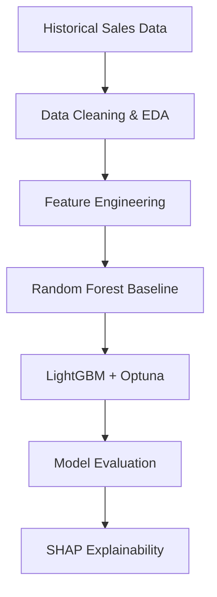

# 📈 SKU Sales Forecasting for Inventory Planning | Python, LightGBM, SHAP

Forecast daily sales quantity for each SKU using Machine Learning and Time Series Feature Engineering.

---

# 📑 Table of Contents

- [📖 Project Overview](#-project-overview)
- [🛠️ Technology Stack](#️-technology-stack)
- [📂 Dataset](#-dataset)
- [🔄 Project Workflow](#-project-workflow)
- [1️⃣ Data Preprocessing & EDA](#1️⃣-data-preprocessing--eda)
- [2️⃣ Feature Engineering](#2️⃣-feature-engineering)
- [3️⃣ Model Training](#3️⃣-model-training)
- [4️⃣ Model Evaluation & Business Insights](#4️⃣-model-evaluation--business-insights)

---

# 📖 Project Overview

## 📌 Business Problem

An e-commerce company wants to optimize inventory management and purchasing planning. However, demand forecasting currently relies heavily on manual estimation and operational experience, resulting in several business challenges:

- Stock shortages for fast-selling SKUs, leading to lost sales and poor customer experience.
- Excess inventory for slow-moving SKUs, increasing warehousing and holding costs.
- Difficulties in purchasing planning and inventory allocation across warehouses.

To solve these issues, the company needs a **Sales Forecasting system** capable of predicting the **daily sales quantity for each SKU**, enabling more accurate inventory and replenishment decisions.

---

## 🎯 Project Objectives

This project develops an **end-to-end Machine Learning pipeline** that forecasts **daily sales quantity (`qty`) at the SKU level**.

The pipeline includes:

- Data preprocessing and exploratory data analysis.
- Time-series feature engineering.
- Forecasting model development.
- Hyperparameter optimization.
- Model interpretation using SHAP.

---

## ❓ Business Questions

This project aims to answer the following questions:

- How many units of each SKU are expected to be sold on a given day?
- Which historical sales patterns best predict future demand?
- Can LightGBM outperform a Random Forest baseline?
- Which factors influence the model's predictions and how can these insights support business decisions?

---

# 🛠️ Technology Stack

| Category | Technologies |
|----------|--------------|
| Programming | Python |
| Data Processing | Pandas, NumPy |
| Data Visualization | Matplotlib, Seaborn |
| Machine Learning | Scikit-learn, LightGBM |
| Hyperparameter Optimization | Optuna |
| Model Explainability | SHAP |
| Development | Jupyter Notebook, VS Code |
| Version Control | Git, GitHub |

---

# 📂 Dataset

The dataset contains historical daily sales transactions collected at SKU level.

| Column | Description |
|---------|-------------|
| shipped_date | Sales date |
| sku | Product identifier |
| channel | Sales channel |
| qty | Daily sales quantity *(Target)* |
| revenue | Sales revenue |
| COGS | Cost of Goods Sold |
| MOQ_orders | Minimum order quantity |

---

# 🔄 Project Workflow

---

# 1️⃣ Data Preprocessing & EDA

## Overview

The raw sales data was cleaned and explored before model development.

Main preprocessing tasks:

- Handle missing values.
- Detect and correct outliers.
- Validate data quality.
- Analyze sales distributions.
- Explore SKU-level demand patterns.

### Sales Quantity Distribution

**Key Insight**

- Sales quantity is highly right-skewed.
- Most transactions involve relatively small quantities, while a few transactions contribute very large sales volumes.

---

### Correlation Analysis

**Key Insight**

- Revenue and COGS are strongly correlated with sales quantity.
- Quantity is the primary driver of revenue.

---

### SKU Sales Analysis

**Key Insight**

Demand varies significantly across products, highlighting the importance of SKU-level forecasting.

---

# 2️⃣ Feature Engineering

## Overview

To improve forecasting performance, historical sales data was transformed into time-series features that capture seasonality, trends, and product-specific demand behavior.

### Engineered Features

| Feature Group | Variables |
|--------------|-----------|
| Temporal | Month, Day, Week, Quarter |
| Calendar | Weekend, Holiday, Even Day |
| SKU Statistics | Mean Qty by Weekday, Mean Qty by Month |
| Historical Demand | Lag1, Lag7, Lag30 |
| Trend | Rolling Mean (7/30), Rolling Std (7/30) |
| Target Transformation | log(1 + qty) |

### Outcome

The final dataset contains both raw sales information and engineered time-series features, providing richer information for model training.

---

# 3️⃣ Model Training

## Training Strategy

Two forecasting models were developed:

- Random Forest (Baseline)
- LightGBM (Final Model)

The LightGBM model was further optimized using:

- TimeSeriesSplit
- Optuna Hyperparameter Optimization

---

## Model Performance

### Key Result

Compared with the Random Forest baseline, the optimized LightGBM model achieved:

- Lower prediction error.
- Higher explanatory power.
- Better overall forecasting accuracy.

---

# 4️⃣ Model Evaluation & Business Insights

## Forecast Performance

The forecasting model successfully captures the overall sales trend while maintaining relatively low prediction error across different SKUs.

---

## SHAP Feature Importance

Top Important Features:

1. lag30
2. rolling_mean_7
3. lag1
4. lag7
5. mean_qty_sku_dow

---

## SHAP Beeswarm

The SHAP analysis shows that historical demand contributes much more to predictions than calendar-based features.

---

## Business Insights

The model provides several actionable insights for inventory planning:

- Historical sales are the strongest predictor of future demand.
- Recent sales trends (Lag and Rolling features) significantly influence daily forecasts.
- Calendar-related variables have a smaller but meaningful impact.
- SHAP explanations make model predictions transparent, helping business users understand why demand is expected to increase or decrease for each SKU.

